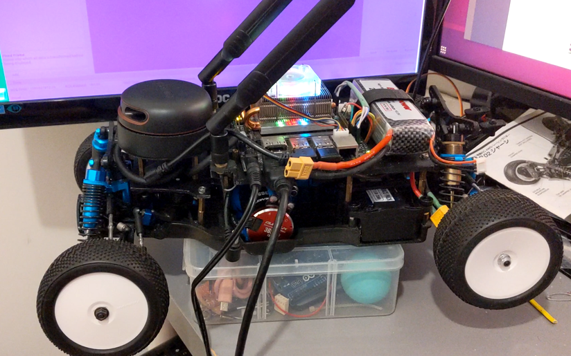
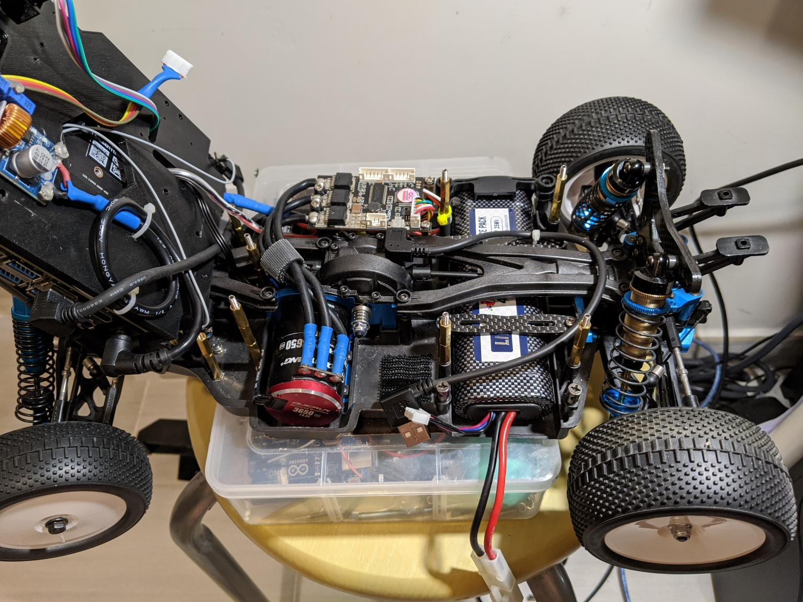
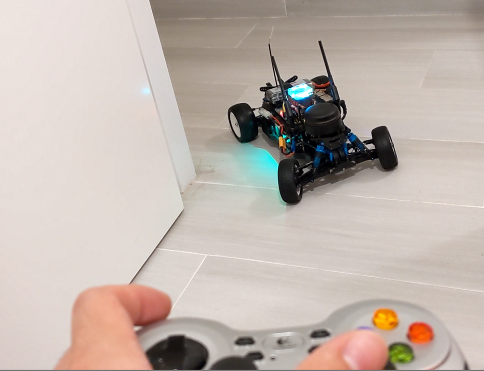

# racecar_nano_v2

This is a 1/10 RC autonomous car project. For project's progress and description, check out the posts in [my linkedin](https://www.linkedin.com/in/oscarkfpang/)

# Components
+ Chassis:  Tamiya DB-02 Leonis with hop-up options
+ Motor:    Hobbywing brushless sensored motor 13.5T
+ ESC:      Flipsky VESC 4.12
+ LIDAR:    RPLIDAR V2
+ System:   Jetson Nano
+ Optional: Intel Realsense D435+T265
+ OS:       Ubuntu 18 + ROS Melodic
+ 

# Installation
1. Initialize ROS catkin workspace (built and run on ROS Melodic)
2. Copy the contents of src into the workspace folder, e.g. 
+ catkin_ws/src/
3. Run catkin_make to compile the folder
4. Source the workspace devel/setup.bash in the terminal
5. In the same terminal, run *roslaunch mushr_base teleop_test2.launch

# Source of Reference
This project and its codes are inspired and adopted from various sources, with some modifications.
+ [Nvidia Jetracer](https://github.com/NVIDIA-AI-IOT/jetracer)
+ U of Washington's [Multi-agent System for non-Holonomic Racing (MuSHR)](https://mushr.io/)
+ [MIT Racecar](https://mit-racecar.github.io/)
+ JetsonHacks [RACECAR/J](https://www.jetsonhacks.com/racecar-j/)

# Reference Photos
+ https://www.linkedin.com/posts/oscarkfpang_workfromhome-covid19-autonomousdriving-activity-6664925283780571137-85lV

# Reference Videos
+ https://www.linkedin.com/posts/oscarkfpang_racecar-slam-autonomousdriving-activity-6692377238677155840-GB9p
+ https://www.linkedin.com/posts/oscarkfpang_second-part-test-driving-with-the-joypad-activity-6692381196153958400-5aa9
